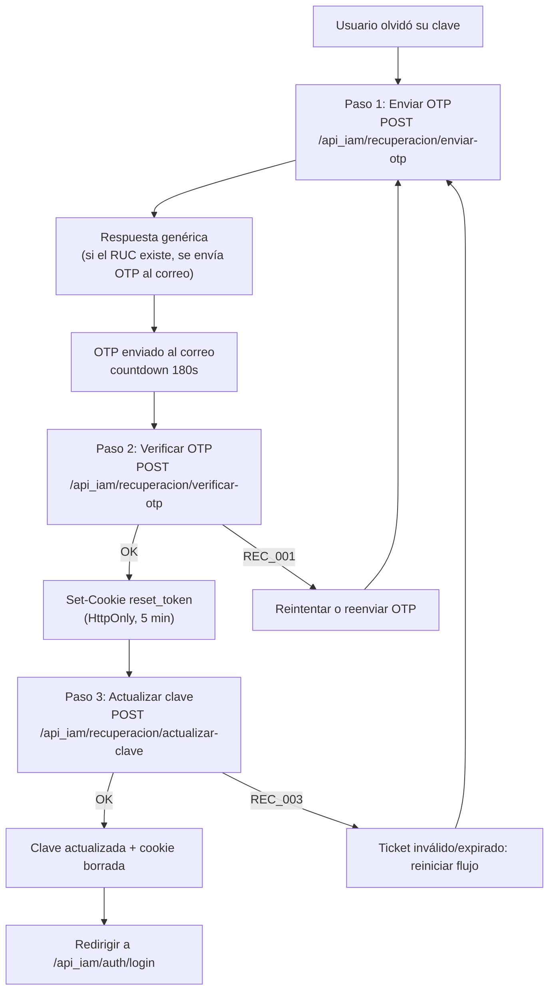
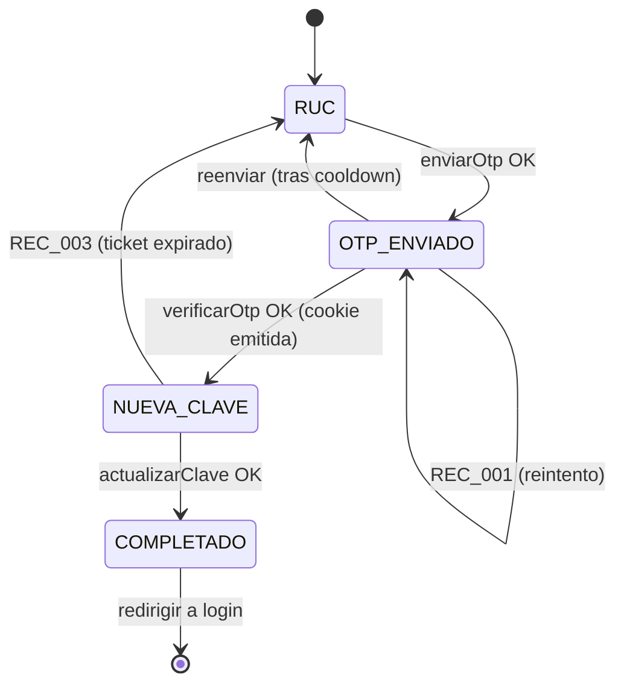

# Recuperación de contraseña con OTP — Guía de endpoints e integración frontend

Flujo público (sin JWT de sesión) para restablecer la contraseña de un usuario existente identificándolo por su RUC, confirmando la posesión del correo con un código OTP de un solo uso y actualizando la clave mediante un "reset ticket" de vida corta que viaja en una cookie `HttpOnly`.

El RUC es el identificador de login (`tm_usuario.usuario = RUC`), coherente con el alta de [registro con OTP](REGISTRO-OTP.md).

- Base URL local: `http://localhost:8080`
- Prefijo de rutas: `/api_iam/recuperacion`
- Documentación interactiva: [Swagger UI](http://localhost:8080/swagger-ui.html) · OpenAPI JSON: `/v3/api-docs`

> Este flujo **no** inicia sesión. Al completar el paso 3 solo se confirma que la contraseña fue actualizada; luego el usuario debe autenticarse en `POST /api_iam/auth/login` con su RUC.

---

## Índice

- [Flujo general](#flujo-general)
- [Convenciones](#convenciones)
- [Contrato de las APIs](#contrato-de-las-apis)
  - [Paso 1 — Enviar OTP](#paso-1--enviar-otp)
  - [Paso 2 — Verificar OTP](#paso-2--verificar-otp)
  - [Paso 3 — Actualizar clave](#paso-3--actualizar-clave)
- [La cookie reset_token](#la-cookie-reset_token)
- [Códigos de error](#códigos-de-error)
- [Reglas de negocio y límites](#reglas-de-negocio-y-límites)
- [Comportamiento local vs producción](#comportamiento-local-vs-producción)
- [Nota de seguridad sobre la clave](#nota-de-seguridad-sobre-la-clave)
- [Guía de implementación frontend](#guía-de-implementación-frontend)
- [Apéndice: prerrequisito de base de datos](#apéndice-prerrequisito-de-base-de-datos)

---

## Flujo general



Los tres pasos son públicos (`SecurityConfig` marca `/api_iam/recuperacion/**` como `permitAll`) y todos aceptan un `recaptchaToken` con `action=reset_password`. El RUC enviado en el paso 1 debe corresponder a un usuario ya creado (p. ej. vía [registro](REGISTRO-OTP.md)).

---

## Convenciones

### Envelope de éxito — `ApiResponseDto<T>`

```json
{
  "data": { }
}
```

### Envelope de error — `ApiErrorResponse`

```json
{
  "code": "REC_001",
  "message": "Código inválido o expirado",
  "descripcion": "Detalle opcional (solo en algunos errores, p. ej. VAL_001)"
}
```

### Autenticación por ruta

| Ruta | Auth |
|------|------|
| `POST /api_iam/recuperacion/enviar-otp` | Público + reCAPTCHA `action=reset_password` |
| `POST /api_iam/recuperacion/verificar-otp` | Público + reCAPTCHA `action=reset_password` |
| `POST /api_iam/recuperacion/actualizar-clave` | Público + reCAPTCHA `action=reset_password` + cookie `reset_token` |

---

## Contrato de las APIs

### Paso 1 — Enviar OTP

`POST /api_iam/recuperacion/enviar-otp`

Identifica al usuario por RUC, genera un OTP de 6 dígitos, lo guarda hasheado y lo envía al correo registrado. **No** devuelve el código.

**Request** (`EnviarOtpRecuperacionWebRequest`):

```json
{
  "ruc": "20123456789",
  "recaptchaToken": "03AGdBq..."
}
```

| Campo | Tipo | Requerido | Validación |
|-------|------|-----------|------------|
| `ruc` | string | sí | Exactamente 11 dígitos (`\d{11}`) |
| `recaptchaToken` | string | según ambiente | Obligatorio si `recaptcha.enabled=true` |

**Response 200** (`ApiResponseDto<EnviarOtpRecuperacionResponse>`):

```json
{
  "data": {
    "mensaje": "Si el RUC está registrado, enviaremos un código de recuperación al correo asociado",
    "expiraEnSegundos": 180,
    "correoEnmascarado": "ju***@empresa.com"
  }
}
```

- **Protección anti-enumeración:** aunque el RUC no exista o no tenga correo asociado, la respuesta es la misma 200 con el mismo `mensaje` y `correoEnmascarado: null`. El frontend siempre debe avanzar al paso 2 sin revelar si el RUC existe.
- Usa `expiraEnSegundos` para el countdown y para deshabilitar el reenvío hasta que termine el cooldown (60s).
- `correoEnmascarado` (cuando viene) sirve para indicar al usuario a qué correo se envió el código.

---

### Paso 2 — Verificar OTP

`POST /api_iam/recuperacion/verificar-otp`

Valida el OTP contra el registro pendiente del RUC. Si es correcto, emite un **reset ticket** (JWT corto) que se entrega **únicamente** en la cookie `HttpOnly` `reset_token` (nunca en el body).

**Request** (`VerificarOtpRecuperacionWebRequest`):

```json
{
  "ruc": "20123456789",
  "otp": "123456",
  "recaptchaToken": "03AGdBq..."
}
```

| Campo | Tipo | Requerido | Validación |
|-------|------|-----------|------------|
| `ruc` | string | sí | 11 dígitos (`\d{11}`) |
| `otp` | string | sí | Exactamente 6 dígitos (`\d{6}`) |
| `recaptchaToken` | string | según ambiente | Obligatorio si `recaptcha.enabled=true` |

**Response 200** (`ApiResponseDto<...>`) + cabecera `Set-Cookie: reset_token=...`:

```json
{
  "data": {
    "mensaje": "Código verificado. Crea tu nueva clave",
    "expiraEnSegundos": 300
  }
}
```

- El `resetToken` **no** viaja en el body; el navegador guarda la cookie automáticamente.
- `expiraEnSegundos` (300 = 5 min) es la vida del reset ticket: el paso 3 debe completarse antes de que caduque.

---

### Paso 3 — Actualizar clave

`POST /api_iam/recuperacion/actualizar-clave`

Actualiza la contraseña usando el reset ticket de la cookie `reset_token`. Requiere que la cookie esté presente (el navegador la envía automáticamente si `withCredentials=true`). Al terminar, borra la cookie.

**Request** (`ActualizarClaveRecuperacionWebRequest`) + cookie `reset_token`:

```json
{
  "nuevaClave": "MiClave#2026",
  "confirmarClave": "MiClave#2026",
  "recaptchaToken": "03AGdBq..."
}
```

| Campo | Tipo | Requerido | Validación |
|-------|------|-----------|------------|
| `nuevaClave` | string | sí | Política de contraseña (`@ValidPassword`, ver [límites](#reglas-de-negocio-y-límites)) |
| `confirmarClave` | string | sí | Debe coincidir con `nuevaClave` |
| `recaptchaToken` | string | según ambiente | Obligatorio si `recaptcha.enabled=true` |
| cookie `reset_token` | cookie | sí | Emitida en el paso 2; si falta o expiró → `REC_003` |

**Response 200** (`ApiResponseDto<ActualizarClaveRecuperacionResponse>`) + `Set-Cookie` que borra `reset_token`:

```json
{
  "data": {
    "mensaje": "Contraseña actualizada correctamente"
  }
}
```

- El RUC no se envía en el body: se extrae del claim del reset ticket, garantizando que la clave se actualice solo para el RUC verificado en el paso 2.
- En éxito, muestra confirmación y redirige a login.

---

## La cookie `reset_token`

El reset ticket se transporta en una cookie gestionada por `AuthCookieService`, con estos atributos:

| Atributo | Valor | Nota |
|----------|-------|------|
| Nombre | `reset_token` | JWT firmado, tipo `reset_password`, con claim `ruc` |
| `HttpOnly` | `true` | No accesible desde JavaScript |
| `Secure` | `security.cookies.secure` | `false` en local (HTTP), `true` en producción (HTTPS) |
| `SameSite` | `Strict` | |
| `Path` | `/api_iam/recuperacion` | La cookie solo se envía a los endpoints de recuperación |
| `Max-Age` | `jwt.reset-expiration-time` | 300000 ms ≈ 5 min |

Implicaciones para el frontend:

- El cliente HTTP debe usar `withCredentials: true` para que la cookie se guarde en el paso 2 y se reenvíe en el paso 3.
- No hay que leer ni manipular la cookie manualmente (es `HttpOnly`); el navegador la gestiona.
- Por el `Path` restringido, la cookie no interfiere con las cookies de sesión (`access_token`, `refresh_token`).

---

## Códigos de error

Todos los errores usan el envelope `{ code, message, descripcion }`.

| Código | HTTP | Significado | Acción sugerida en UI |
|--------|------|-------------|-----------------------|
| `VAL_001` | 400 | Validación de campos (ver `descripcion`); incluye clave que no cumple `@ValidPassword` | Resaltar campos inválidos |
| `RUC_000` | 400 | RUC con formato inválido | Corregir el RUC |
| `REC_001` | 400 | Código OTP inválido, expirado o bloqueado por intentos | Permitir reintento o reenvío |
| `REC_003` | 400 | Reset ticket ausente, inválido o expirado | Reiniciar el flujo desde el paso 1 |
| `REC_004` | 400 | `nuevaClave` y `confirmarClave` no coinciden | Pedir que reescriba las claves |
| `REC_005` | 400 | No se pudo actualizar la contraseña en BD | Reintentar / soporte |
| `PWD_001` | 400 | La clave no cumple la política (validación de servicio) | Mostrar requisitos de la clave |
| `REG_THROTTLE_OTP` | 429 | Límite de envíos de OTP por correo/RUC | Esperar (cooldown 60s) |
| `CAPTCHA_001` | 400 | reCAPTCHA fallido | Regenerar token y reintentar |
| `SYS_001` | 500 | Error no controlado | Mensaje genérico / reintentar |

> Nota de seguridad: el backend devuelve el mismo mensaje "Código inválido o expirado" (`REC_001`) para OTP incorrecto, expirado o bloqueado por intentos, para no filtrar el estado interno. En el paso 1 nunca se indica si el RUC existe.

---

## Reglas de negocio y límites

Valores por defecto (configurables en `application-*.yaml`):

| Regla | Valor por defecto | Fuente |
|-------|-------------------|--------|
| Duración del OTP (TTL) | 180 s (3 min) | `otp.ttl-seconds` |
| Longitud del OTP | 6 dígitos | `otp.length` |
| Intentos máximos de OTP | 5 | `otp.max-attempts` |
| Cooldown entre reenvíos | 60 s por correo | `otp.throttle.send-cooldown-seconds` |
| Máx. envíos por hora | 5 por correo y por RUC | `otp.throttle.max-sends-per-hour` |
| Vida del reset ticket | 300 s (5 min) | `jwt.reset-expiration-time` |

Política de contraseña (`nuevaClave`):

- Longitud mínima: 8 · máxima: 128
- Requiere al menos: 1 mayúscula, 1 minúscula, 1 dígito y 1 carácter especial

Ejemplo válido: `MiClave#2026`.

---

## Comportamiento local vs producción

El perfil `local` (`application-local.yaml`) facilita las pruebas sin dependencias externas:

| Aspecto | Local (`local`) | Producción |
|---------|-----------------|------------|
| Envío de correo | Según `otp.email.enabled`: si `false`, el OTP no se envía; si `true`, se usa el SMTP configurado | SMTP real, correo enviado |
| reCAPTCHA | `recaptcha.enabled=false` → el `recaptchaToken` es opcional | Obligatorio, `action=reset_password` |
| Cookies `Secure` | `false` (HTTP) | `true` (HTTPS) |

Cómo obtener el OTP en local: si `otp.email.enabled=true` con un SMTP válido, llega al correo; si está deshabilitado, revisa la consola/log del backend tras el paso 1.

---

## Nota de seguridad sobre la clave

- La `nuevaClave` viaja en **texto plano dentro del body** (protegida por HTTPS en producción) y el backend la hashea con **BCrypt** antes de persistirla. El frontend **no** debe cifrar la clave.
- El reset ticket es un JWT corto (5 min), `HttpOnly`, con el RUC embebido como claim; la actualización solo aplica al RUC verificado en el paso 2.
- CORS: el backend usa `allowCredentials=true` con orígenes explícitos (`security.cors.allowed-origins`, p. ej. `http://localhost:3000`, `:8081`, `:8082`). El origen del frontend debe estar en esa lista para que las cookies funcionen.

---

## Guía de implementación frontend

### 1. Cliente HTTP

```javascript
import axios from "axios";

export const api = axios.create({
  baseURL: "http://localhost:8080/api_iam",
  withCredentials: true, // imprescindible: guarda/reenvía la cookie reset_token
  headers: { "Content-Type": "application/json" },
});
```

### 2. Servicio de recuperación

```javascript
export const recuperacionApi = {
  enviarOtp: (ruc, recaptchaToken) =>
    api.post("/recuperacion/enviar-otp", { ruc, recaptchaToken }).then((r) => r.data.data),

  verificarOtp: (ruc, otp, recaptchaToken) =>
    api.post("/recuperacion/verificar-otp", { ruc, otp, recaptchaToken }).then((r) => r.data.data),

  actualizarClave: (nuevaClave, confirmarClave, recaptchaToken) =>
    api
      .post("/recuperacion/actualizar-clave", { nuevaClave, confirmarClave, recaptchaToken })
      .then((r) => r.data.data),
};
```

### 3. Máquina de estados del asistente (wizard)



Estado mínimo a mantener: `ruc` (para reutilizar entre pasos 1 y 2) y un `cooldown` para el botón de reenvío. El `reset_token` lo maneja el navegador (cookie), no el estado del frontend.

### 4. reCAPTCHA (`action=reset_password`)

Genera el token **justo antes** de cada llamada (los tokens v3 caducan y son de un solo uso):

```javascript
const recaptchaToken = await grecaptcha.execute(SITE_KEY, { action: "reset_password" });
```

En local (`recaptcha.enabled=false`) puedes enviar `recaptchaToken` vacío u omitirlo.

### 5. Countdown y reenvío

```javascript
// tras enviarOtp:
const { expiraEnSegundos, correoEnmascarado } = await recuperacionApi.enviarOtp(ruc, token);
// iniciar cuenta regresiva con expiraEnSegundos (180)
// habilitar "Reenviar código" solo después de 60s (cooldown del backend)
// mostrar correoEnmascarado si viene (ej. "Enviamos el código a ju***@empresa.com")
```

### 6. Validación de la clave en cliente

Replica la política del backend para evitar `VAL_001`/`PWD_001`:

```javascript
const passwordRegex =
  /^(?=.*[a-z])(?=.*[A-Z])(?=.*\d)(?=.*[^A-Za-z0-9]).{8,128}$/;
```

### 7. Manejo de errores

```javascript
function mensajeDeError(error) {
  const err = error?.response?.data; // { code, message, descripcion }
  switch (err?.code) {
    case "RUC_000": return "El RUC no es válido.";
    case "REC_001": return "El código es inválido o expiró. Solicita uno nuevo.";
    case "REC_003": return "La sesión de recuperación expiró. Vuelve a empezar.";
    case "REC_004": return "Las contraseñas no coinciden.";
    case "REC_005": return "No se pudo actualizar la contraseña. Intenta nuevamente.";
    case "PWD_001": return "La contraseña no cumple los requisitos de seguridad.";
    case "REG_THROTTLE_OTP": return "Demasiados envíos. Espera unos minutos.";
    case "CAPTCHA_001": return "No se pudo validar el reCAPTCHA. Reintenta.";
    case "VAL_001": return err.descripcion || "Datos inválidos.";
    default: return err?.message || "Ocurrió un error. Intenta nuevamente.";
  }
}
```

### 8. Ejemplo de secuencia completa

```javascript
// Paso 1
await recuperacionApi.enviarOtp("20123456789", await captcha());
// mostrar pantalla de OTP (siempre, sin revelar si el RUC existe)

// Paso 2 (emite la cookie reset_token)
await recuperacionApi.verificarOtp("20123456789", "123456", await captcha());

// Paso 3 (usa la cookie automáticamente)
const res = await recuperacionApi.actualizarClave("MiClave#2026", "MiClave#2026", await captcha());
// res.mensaje -> redirigir a login
```

---

## Apéndice: prerrequisito de base de datos

Antes de desplegar el flujo, el DBA debe ejecutar el script:

`src/main/resources/db/n_iam_recuperacion_otp.sql`

Crea la tabla de tracking `n_iam.recuperacion_otp` y las funciones:

| Objeto | Rol |
|--------|-----|
| `n_iam.recuperacion_otp` | Tabla de OTP de recuperación (TTL, intentos, RUC, correo, `usuario_uuid`) |
| `fn_insertar_recuperacion_otp(...)` | Anula OTP previos del RUC e inserta uno nuevo (paso 1) |
| `fn_validar_recuperacion_otp(ruc, otp_hash)` | Valida el OTP: controla expiración, intentos y estado (paso 2) |
| `fn_recuperar_actualizar_clave(ruc, clave_hash)` | Actualiza la clave por RUC (paso 3). **MOCKUP**: el DBA debe reemplazar por el UPDATE real sobre `n_iam.tm_usuario.clave_hash` donde `usuario = p_ruc` |

Resultados posibles de `fn_recuperar_actualizar_clave` mapeados por el backend:

- `ACTUALIZADO` → éxito; el backend responde con el mensaje fijo `"Contraseña actualizada correctamente"`.
- Cualquier otro → `REC_005` con mensaje fijo `"No se pudo actualizar la contraseña"` (el backend **no** propaga `r_mensaje` al cliente).

> El OTP se almacena **hasheado** (`otp_hash`), nunca en texto plano; el hash se calcula en el backend con un pepper (`otp.pepper`). La función de actualización recibe la clave ya hasheada con BCrypt. Las cuentas creadas por registro viven en `tm_persona` + `tm_usuario` (ver [REGISTRO-OTP.md](REGISTRO-OTP.md)).
