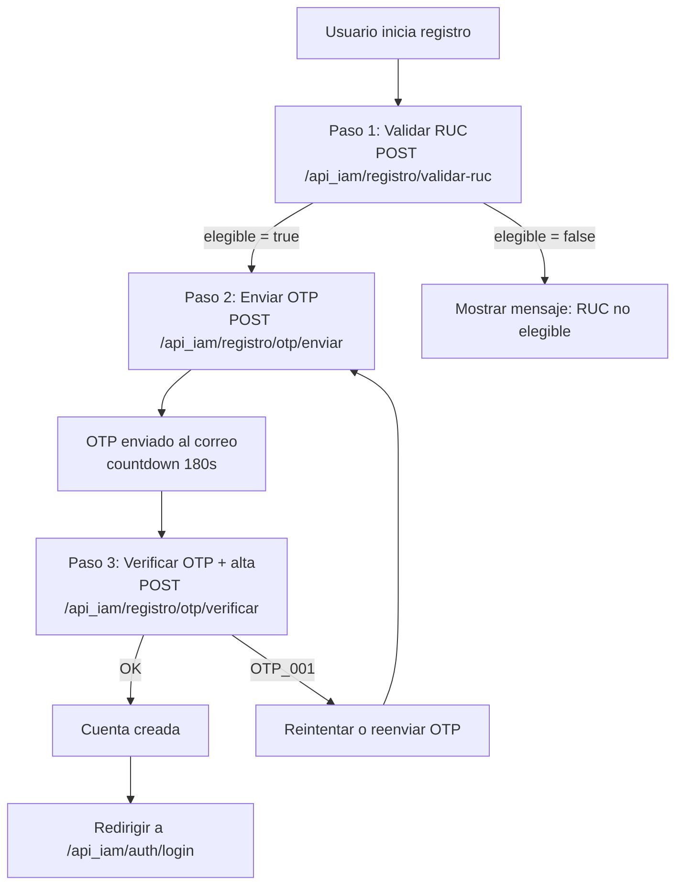
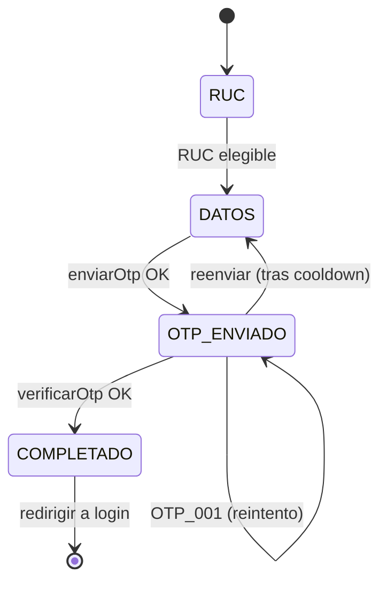

# Registro público con OTP — Guía de endpoints e integración frontend

Flujo público (sin JWT) para el registro de un transportista mediante validación de RUC en SUNAT y confirmación de correo con un código OTP de un solo uso.

- Base URL local: `http://localhost:8080`
- Prefijo de rutas: `/api_iam/registro`
- Documentación interactiva: [Swagger UI](http://localhost:8080/swagger-ui.html) · OpenAPI JSON: `/v3/api-docs`

> El registro **no** inicia sesión automáticamente. Al completar el paso 3 solo se devuelve el `usuarioUuid`; luego el usuario debe autenticarse en `POST /api_iam/auth/login` con el **RUC** como usuario.

---

## Índice

- [Flujo general](#flujo-general)
- [Convenciones](#convenciones)
- [Contrato de las APIs](#contrato-de-las-apis)
  - [Paso 1 — Validar RUC](#paso-1--validar-ruc)
  - [Paso 2 — Enviar OTP](#paso-2--enviar-otp)
  - [Paso 3 — Verificar OTP y registrar](#paso-3--verificar-otp-y-registrar)
- [Códigos de error](#códigos-de-error)
- [Reglas de negocio y límites](#reglas-de-negocio-y-límites)
- [Comportamiento local vs producción](#comportamiento-local-vs-producción)
- [Nota de seguridad sobre la clave](#nota-de-seguridad-sobre-la-clave)
- [Guía de implementación frontend](#guía-de-implementación-frontend)
- [Apéndice: prerrequisito de base de datos](#apéndice-prerrequisito-de-base-de-datos)

---

## Flujo general



Los tres pasos son públicos (`SecurityConfig` los marca `permitAll`) y todos aceptan un `recaptchaToken` con `action=register`.

---

## Convenciones

### Envelope de éxito — `ApiResponseDto<T>`

```json
{
  "data": { }
}
```

### Envelope de error — `ApiErrorResponse`

```json
{
  "code": "OTP_001",
  "message": "Código inválido o expirado",
  "descripcion": "Detalle opcional (solo en algunos errores, p. ej. VAL_001)"
}
```

### Autenticación por ruta

| Ruta | Auth |
|------|------|
| `POST /api_iam/registro/validar-ruc` | Público + reCAPTCHA `action=register` |
| `POST /api_iam/registro/otp/enviar` | Público + reCAPTCHA `action=register` |
| `POST /api_iam/registro/otp/verificar` | Público + reCAPTCHA `action=register` |

---

## Contrato de las APIs

### Paso 1 — Validar RUC

`POST /api_iam/registro/validar-ruc`

Consulta el RUC en SUNAT y determina si es elegible (ACTIVO y HABIDO).

**Request** (`ValidarRucWebRequest`):

```json
{
  "ruc": "20123456789",
  "recaptchaToken": "03AGdBq..."
}
```

| Campo | Tipo | Requerido | Validación |
|-------|------|-----------|------------|
| `ruc` | string | sí | Exactamente 11 dígitos (`\d{11}`) |
| `recaptchaToken` | string | según ambiente | Obligatorio si `recaptcha.enabled=true` |

**Response 200** (`ApiResponseDto<ValidarRucRegistroResponse>`):

```json
{
  "data": {
    "ruc": "20123456789",
    "razonSocial": "EMPRESA DEMO S.A.C.",
    "estado": "ACTIVO",
    "condicion": "HABIDO",
    "elegible": true,
    "mensaje": "RUC ACTIVO y HABIDO en SUNAT. Continúa para confirmar tu correo"
  }
}
```

- Si `elegible = false`, el frontend debe mostrar `mensaje` y **no** avanzar al paso 2.
- Guarda `ruc` y `razonSocial` para reutilizarlos en el paso 2.

---

### Paso 2 — Enviar OTP

`POST /api_iam/registro/otp/enviar`

Valida los datos, genera un OTP de 6 dígitos, guarda el registro pendiente (con la clave ya hasheada) y envía el código por correo. **No** devuelve el código.

**Request** (`EnviarOtpRegistroWebRequest`):

```json
{
  "ruc": "20123456789",
  "personaContacto": "Juan Pérez",
  "correo": "juan@empresa.com",
  "telefono": "999888777",
  "clave": "MiClave#2026",
  "razonSocial": "EMPRESA DEMO S.A.C.",
  "recaptchaToken": "03AGdBq..."
}
```

| Campo | Tipo | Requerido | Validación |
|-------|------|-----------|------------|
| `ruc` | string | sí | 11 dígitos (`\d{11}`) |
| `personaContacto` | string | sí | No vacío, máx. 255 |
| `correo` | string | sí | Formato email, máx. 255 |
| `telefono` | string | sí | Entre 7 y 20 caracteres |
| `clave` | string | sí | Política de contraseña (ver [límites](#reglas-de-negocio-y-límites)) |
| `razonSocial` | string | no | Máx. 512. Si se omite, se usa la de SUNAT |
| `recaptchaToken` | string | según ambiente | Obligatorio si `recaptcha.enabled=true` |

**Response 200** (`ApiResponseDto<EnviarOtpRegistroResponse>`):

```json
{
  "data": {
    "mensaje": "Se envió un código de verificación al correo indicado",
    "expiraEnSegundos": 180
  }
}
```

- Usa `expiraEnSegundos` para el countdown y para deshabilitar el reenvío hasta que termine el cooldown (60s).

---

### Paso 3 — Verificar OTP y registrar

`POST /api_iam/registro/otp/verificar`

Valida el OTP contra el registro pendiente y crea la cuenta (`n_iam.fn_registrar_usuario`). Es transaccional.

**Request** (`VerificarOtpRegistroWebRequest`):

```json
{
  "correo": "juan@empresa.com",
  "otp": "123456",
  "recaptchaToken": "03AGdBq..."
}
```

| Campo | Tipo | Requerido | Validación |
|-------|------|-----------|------------|
| `correo` | string | sí | Formato email (el mismo del paso 2) |
| `otp` | string | sí | Exactamente 6 dígitos (`\d{6}`) |
| `recaptchaToken` | string | según ambiente | Obligatorio si `recaptcha.enabled=true` |

**Response 200** (`ApiResponseDto<VerificarOtpRegistroResponse>`):

```json
{
  "data": {
    "usuarioUuid": "aaaaaaaa-bbbb-cccc-dddd-eeeeeeeeeeee",
    "mensaje": "Usuario registrado correctamente"
  }
}
```

- Solo necesita `correo` + `otp`; conserva el `correo` del paso 2 para no volver a pedirlo.
- En éxito, muestra confirmación y redirige a login. El identificador de acceso es el **RUC** (`tm_usuario.usuario = RUC`); la cuenta se crea en `tm_persona` + `tm_usuario` con `tipo_estado_usuario_id = 2`.
- Si el usuario olvida la clave después del alta, usa el flujo de [recuperación con OTP](RECUPERACION-OTP.md).

---

## Códigos de error

Todos los errores usan el envelope `{ code, message, descripcion }`.

| Código | HTTP | Significado | Acción sugerida en UI |
|--------|------|-------------|-----------------------|
| `VAL_001` | 400 | Validación de campos (ver `descripcion`) | Resaltar campos inválidos |
| `RUC_000` | 400 | RUC con formato inválido | Corregir el RUC |
| `RUC_001` | 400 | RUC no encontrado en SUNAT | Verificar el RUC |
| `RUC_002` | 400 | Servicio RUC no configurado | Mensaje genérico / reintentar luego |
| `RUC_003` | 400 | SUNAT no disponible | Reintentar más tarde |
| `RUC_004` | 400 | RUC no ACTIVO/HABIDO (no elegible) | Bloquear avance, mostrar mensaje |
| `REG_001` | 400 | Correo inválido | Corregir el correo |
| `PWD_001` | 400 | La clave no cumple la política | Mostrar requisitos de la clave |
| `OTP_001` | 400 | Código inválido o expirado | Permitir reintento o reenvío |
| `REG_002` | 400 | Usuario/correo ya registrado. El `message` es `r_mensaje` de BD (p. ej. RUC o correo duplicado) | Mostrar `message` y sugerir ir a login |
| `REG_003` | 400 | No se pudo completar el registro. El `message` es `r_mensaje` de BD (validación o SQLERRM) | Mostrar `message`; reintentar / soporte |
| `REG_THROTTLE_OTP` | 429 | Límite de envíos por correo/RUC | Esperar (cooldown 60s) |
| `REG_THROTTLE_RUC` | 429 | Demasiadas validaciones de RUC | Esperar antes de reintentar |
| `CAPTCHA_001` | 400 | reCAPTCHA fallido | Regenerar token y reintentar |
| `SYS_001` | 500 | Error no controlado | Mensaje genérico / reintentar |

> Nota de seguridad: el backend devuelve el mismo mensaje "Código inválido o expirado" (`OTP_001`) para OTP incorrecto, expirado o bloqueado por intentos, para no filtrar el estado interno.

---

## Reglas de negocio y límites

Valores por defecto (configurables en `application-*.yaml`):

| Regla | Valor por defecto | Fuente |
|-------|-------------------|--------|
| Duración del OTP (TTL) | 180 s (3 min) | `otp.ttl-seconds` |
| Longitud del OTP | 6 dígitos | `otp.length` |
| Intentos máximos de OTP | 5 | `otp.max-attempts` |
| Cooldown entre reenvíos | 60 s por correo | `otp.throttle.send-cooldown-seconds` |
| Máx. envíos por hora | 5 por correo y por RUC | `otp.throttle.max-sends-per-hour` |
| Máx. validaciones de RUC por hora | 20 por RUC | `otp.throttle.max-ruc-validations-per-hour` |

Política de contraseña (`clave`):

- Longitud mínima: 8 · máxima: 128
- Requiere al menos: 1 mayúscula, 1 minúscula, 1 dígito y 1 carácter especial

Ejemplo válido: `MiClave#2026`.

---

## Comportamiento local vs producción

El perfil `local` (`application-local.yaml`) facilita las pruebas sin dependencias externas:

| Aspecto | Local (`local`) | Producción |
|---------|-----------------|------------|
| Envío de correo | `otp.email.enabled=false` → el OTP **no se envía**; se escribe en el log del backend | SMTP real, correo enviado |
| Consulta SUNAT | `sunat.ruc.enabled=false` → cualquier RUC válido (11 dígitos) devuelve el stub `EMPRESA DEMO S.A.C.` con `elegible=true` | Consulta real a la API de SUNAT |
| reCAPTCHA | `recaptcha.enabled=false` → el `recaptchaToken` es opcional | Obligatorio, `action=register` |
| Cookies `Secure` | `false` (HTTP) | `true` (HTTPS) |

Cómo obtener el OTP en local: revisa la consola/log del backend tras el paso 2. `SmtpEmailService` registra una línea `OTP email skipped (disabled)` y el código se puede rastrear desde el flujo de generación durante desarrollo.

---

## Nota de seguridad sobre la clave

- La `clave` viaja en **texto plano dentro del body** (protegida por HTTPS en producción) y el backend la hashea con **BCrypt** antes de persistirla. El frontend **no** debe cifrar la clave.
- El cifrado RSA/AES (`encryption.enabled=true`) solo aplica a **campos de salida del login** (PII como nombre, correo, teléfono en `LoginData`), no al registro.
- CORS: el backend usa `allowCredentials=true` con orígenes explícitos (`security.cors.allowed-origins`, p. ej. `http://localhost:3000`, `:8081`, `:8082`). El origen del frontend debe estar en esa lista.

---

## Guía de implementación frontend

### 1. Cliente HTTP

```javascript
import axios from "axios";

export const api = axios.create({
  baseURL: "http://localhost:8080/api_iam",
  withCredentials: true, // necesario para login (cookies HttpOnly); mantener consistencia
  headers: { "Content-Type": "application/json" },
});
```

### 2. Servicio de registro

```javascript
export const registroApi = {
  validarRuc: (ruc, recaptchaToken) =>
    api.post("/registro/validar-ruc", { ruc, recaptchaToken }).then((r) => r.data.data),

  enviarOtp: (payload, recaptchaToken) =>
    api.post("/registro/otp/enviar", { ...payload, recaptchaToken }).then((r) => r.data.data),

  verificarOtp: (correo, otp, recaptchaToken) =>
    api.post("/registro/otp/verificar", { correo, otp, recaptchaToken }).then((r) => r.data.data),
};
```

### 3. Máquina de estados del asistente (wizard)



Estado mínimo a mantener: `ruc`, `razonSocial`, `correo` (para reutilizar entre pasos) y un `cooldown` para el botón de reenvío.

### 4. reCAPTCHA (`action=register`)

Genera el token **justo antes** de cada llamada (los tokens v3 caducan y son de un solo uso):

```javascript
const recaptchaToken = await grecaptcha.execute(SITE_KEY, { action: "register" });
```

En local (`recaptcha.enabled=false`) puedes enviar `recaptchaToken` vacío u omitirlo.

### 5. Countdown y reenvío

```javascript
// tras enviarOtp:
const { expiraEnSegundos } = await registroApi.enviarOtp(payload, token);
// iniciar cuenta regresiva con expiraEnSegundos (180)
// habilitar "Reenviar código" solo después de 60s (cooldown del backend)
```

### 6. Validación de la clave en cliente

Replica la política del backend para evitar `PWD_001`:

```javascript
const passwordRegex =
  /^(?=.*[a-z])(?=.*[A-Z])(?=.*\d)(?=.*[^A-Za-z0-9]).{8,128}$/;
```

### 7. Manejo de errores

```javascript
function mensajeDeError(error) {
  const err = error?.response?.data; // { code, message, descripcion }
  switch (err?.code) {
    case "RUC_004": return "El RUC no está ACTIVO y HABIDO en SUNAT.";
    case "PWD_001": return "La contraseña no cumple los requisitos de seguridad.";
    case "OTP_001": return "El código es inválido o expiró. Solicita uno nuevo.";
    case "REG_002":
      return err.message || "El usuario o correo ya está registrado. Intenta iniciar sesión.";
    case "REG_003":
      return err.message || "No se pudo completar el registro.";
    case "REG_THROTTLE_OTP":
    case "REG_THROTTLE_RUC": return "Demasiados intentos. Espera unos minutos.";
    case "CAPTCHA_001": return "No se pudo validar el reCAPTCHA. Reintenta.";
    case "VAL_001": return err.descripcion || "Datos inválidos.";
    default: return err?.message || "Ocurrió un error. Intenta nuevamente.";
  }
}
```

### 8. Ejemplo de secuencia completa

```javascript
// Paso 1
const ruc = await registroApi.validarRuc("20123456789", await captcha());
if (!ruc.elegible) return mostrar(ruc.mensaje);

// Paso 2
await registroApi.enviarOtp(
  {
    ruc: ruc.ruc,
    personaContacto: "Juan Pérez",
    correo: "juan@empresa.com",
    telefono: "999888777",
    clave: "MiClave#2026",
    razonSocial: ruc.razonSocial,
  },
  await captcha()
);

// Paso 3
const alta = await registroApi.verificarOtp("juan@empresa.com", "123456", await captcha());
// alta.usuarioUuid + alta.mensaje -> redirigir a login (usuario = RUC)
```

---

## Apéndice: prerrequisito de base de datos

Antes de desplegar el flujo, el DBA debe ejecutar el script:

`src/main/resources/db/n_iam_registro_otp.sql`

Crea la tabla de tracking `n_iam.registro_otp` y las funciones:

| Objeto | Rol |
|--------|-----|
| `n_iam.registro_otp` | Tabla de OTP pendientes (TTL, intentos, payload y clave hasheada) |
| `fn_insertar_registro_otp(...)` | Anula OTP previos del correo e inserta uno nuevo (paso 2) |
| `fn_validar_registro_otp(correo, otp_hash)` | Valida el OTP: controla expiración, intentos y estado (paso 3) |
| `fn_registrar_usuario(...)` | Alta del usuario en `tm_persona` + `tm_usuario` (validación RUC/correo, unicidad y manejo de errores) |

Resultados posibles de `fn_registrar_usuario` mapeados por el backend:

- `REGISTRADO` → éxito; el response expone `usuarioUuid` y `mensaje` = `r_mensaje` (p. ej. `"Usuario registrado correctamente"`).
- `YA_EXISTE` → el backend responde `REG_002` con `message` = `r_mensaje` (RUC o correo ya registrado).
- `ERROR` u otro → `REG_003` con `message` = `r_mensaje` (detalle de la función / SQLERRM).

> El OTP se almacena **hasheado** (`otp_hash`), nunca en texto plano; el hash se calcula en el backend con un pepper (`otp.pepper`).
